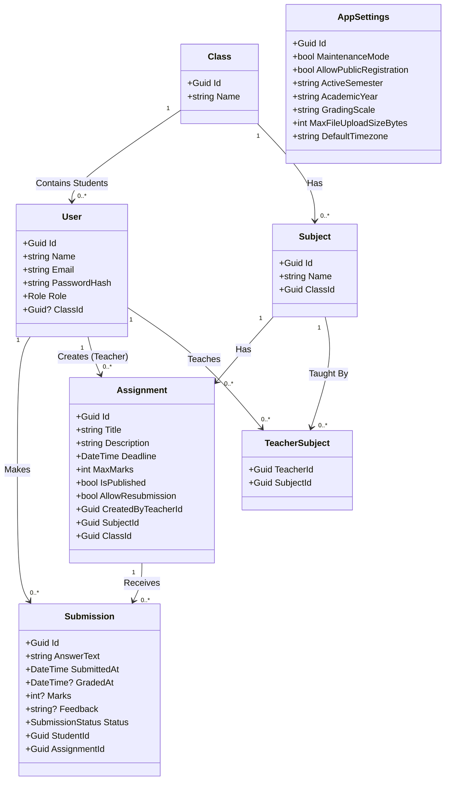

# Khata - System Design & Architecture

This document outlines the architectural decisions, database design, and testing methodology for the Khata Assignment Management System.

## 🏗 System Architecture

The application adopts a **Client-Server Architecture** utilizing a decoupled frontend and backend.

### Frontend: Next.js (React)
- **Framework**: Next.js 16 (App Router) powered by Turbopack.
- **Rendering Strategy**: Uses a hybrid approach. The root layouts employ Server-Side Rendering (SSR) for fast initial paints and layout stability, while the dashboard interfaces rely on Client-Side Rendering (CSR) via the `"use client"` directive to enable rich, interactive state management (modals, dynamic forms, data fetching).
- **Styling**: Tailwind CSS v4 utilizing the new `@theme` inline configuration pattern.

### Backend: ASP.NET Core 8 Web API
- **Design Pattern**: MVC (Model-View-Controller) focused on the API Controller pattern.
- **Data Access**: Entity Framework (EF) Core operating as the ORM. Currently configured to use an `InMemoryDatabase` for rapid prototyping and seamless recruiter evaluation without the overhead of Docker containers or local SQL Server instances.
- **Security**: Stateless JSON Web Token (JWT) Authentication. The API enforces Role-Based Access Control (RBAC) heavily at the controller endpoint level via `[Authorize(Roles = "...")]`.

---

## 📊 Database Schema & UML

The database is normalized to ensure data integrity and avoid redundancy. Below is the UML class diagram representing the EF Core entity relationships.



### Key Relationships
- **User (Student) ↔ Class**: One-to-Many. Students belong to a specific academic class.
- **User (Teacher) ↔ Subject**: Many-to-Many (Resolved via `TeacherSubject` join table). A teacher can teach multiple subjects, and a subject can have multiple teachers.
- **Assignment ↔ Submission**: One-to-Many. An assignment receives multiple submissions from various students.

---

## 🧪 Testing Methodology

The backend incorporates a robust unit testing suite designed to validate core business logic and API controller responses.

- **Framework**: xUnit combined with Moq (for dependency mocking) and FluentAssertions (if applicable).
- **Strategy**: 
  - Controllers are tested in isolation. 
  - The `AppDbContext` is mocked using Entity Framework Core's `UseInMemoryDatabase` provider explicitly provisioned with unique database names per test to ensure parallel test execution without data collision.
- **Execution**: Tests run universally via the .NET CLI.
  ```bash
  cd backend/AssignmentSystem.Tests
  dotnet test
  ```
- **Coverage Context**: Current unit tests validate the integrity of the `SubmissionsController`, ensuring that grading permissions (e.g., verifying a Teacher cannot grade another Teacher's assignment) and submission deadline thresholds operate correctly.
